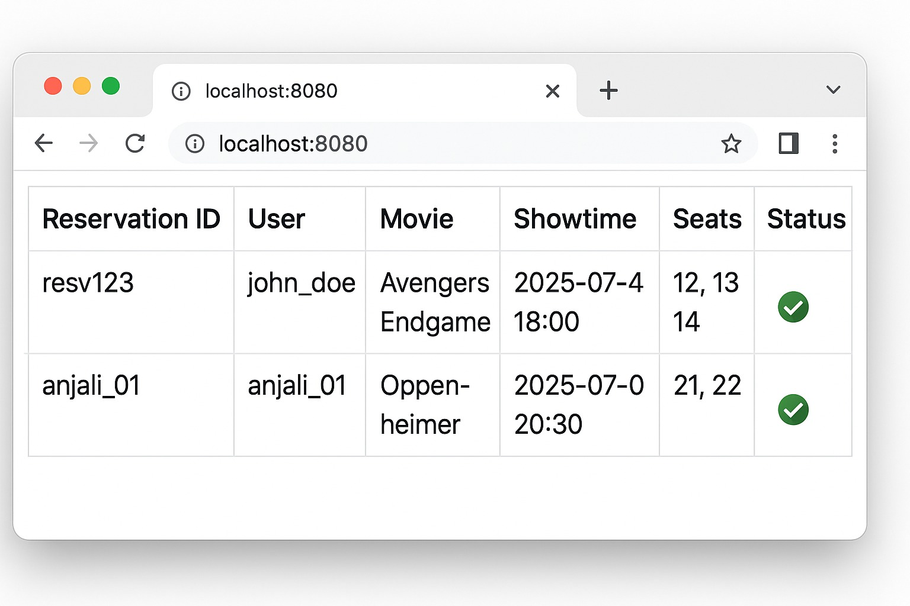

# Asessment7
Movie Reservation System


# 🎬 Java Movie Reservation System

A simple web-based application developed using Java Servlets that allows users to:
- Book movie tickets
- View all reservations in a table format
- Track showtime, seats, and booking status

## 📸 Preview

| Reservation ID | User       | Movie            | Showtime          | Seats     | Status |
|----------------|------------|------------------|-------------------|-----------|--------|
| resv123        | john_doe   | Avengers Endgame | 2025-07-04 18:00  | 12, 13, 14| ✅      |
| anjali_01      | anjali_01  | Oppenheimer      | 2025-07-07 20:30  | 21, 22    | ✅      |

## 🚀 Features

- ✅ Book movie tickets with multiple seat selection
- 📅 View booked showtimes
- 👤 User-specific reservation view
- 🧾 Display reservation status
- 🧮 Server-side table rendering using Java

## 🛠️ Technologies Used

- Java Servlets
- JSP / HTML / CSS
- Apache Tomcat
- JDBC (for database connectivity)
- MySQL (or any relation

- Setup Instructions
Clone the repository:

bash
```
git clone https://github.com/your-username/movie-reservation.git
```
Import into your IDE (Eclipse / IntelliJ)

Add dependencies (PDFBox or JDBC driver if needed)

- Set up the database:


CREATE DATABASE movie_db;
USE movie_db;

```
  CREATE TABLE reservations (
  id VARCHAR(50) PRIMARY KEY,
  username VARCHAR(100),
  movie VARCHAR(100),
  showtime DATETIME,
  seats VARCHAR(100),
  status BOOLEAN
);
```

## Configure DB credentials in ReservationDAO.java

- Deploy to Apache Tomcat and access at http://localhost:8080/movie-reservation

## ✅ Sample Reservation Record (SQL)

```INSERT INTO reservations VALUES```
('resv123', 'john_doe', 'Avengers Endgame', '2025-07-04 18:00:00', '12,13,14', true),
('anjali_01', 'anjali_01', 'Oppenheimer', '2025-07-07 20:30:00', '21,22', true);
📌 Notes
- You can use JDBC or JPA for database access.

- Enhance with Bootstrap or React for better UI.

- Make sure to validate inputs on both client and server sides.
